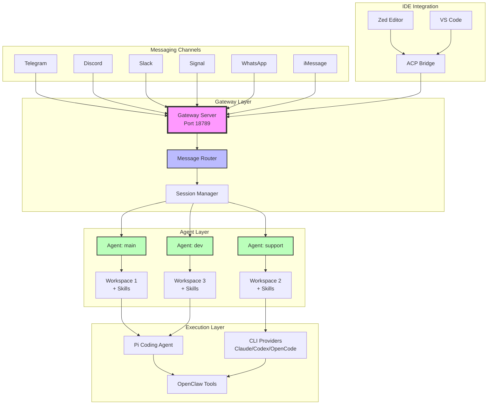
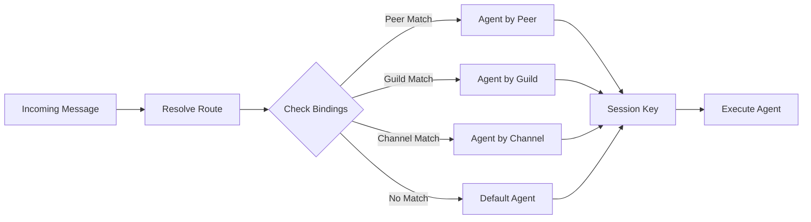
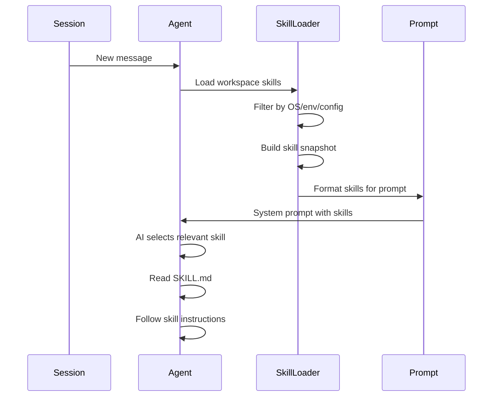
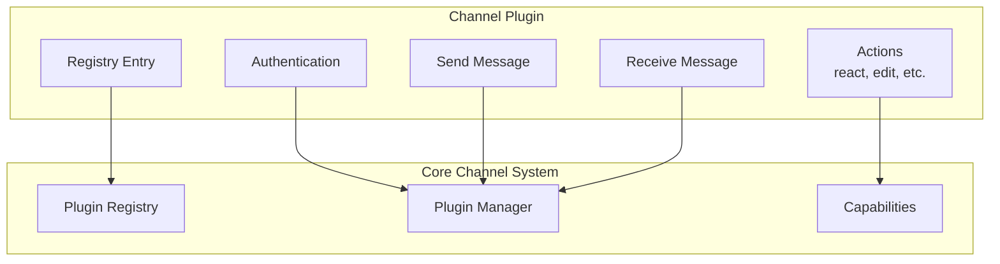
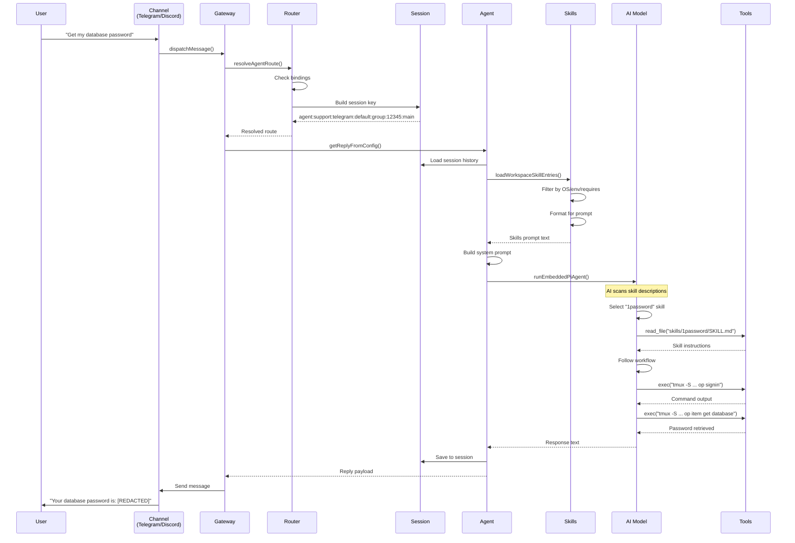
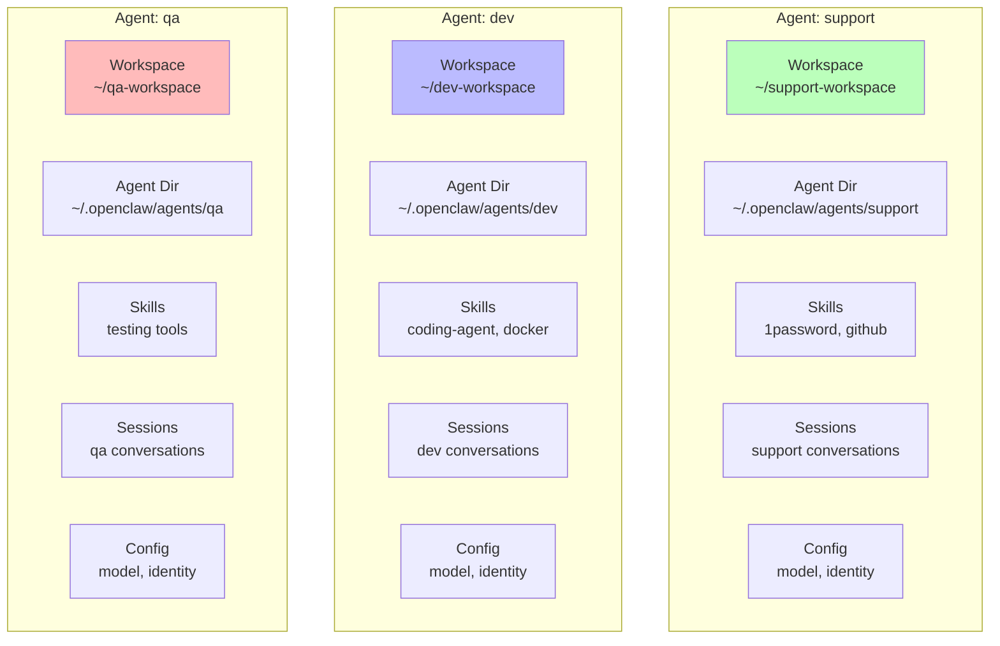
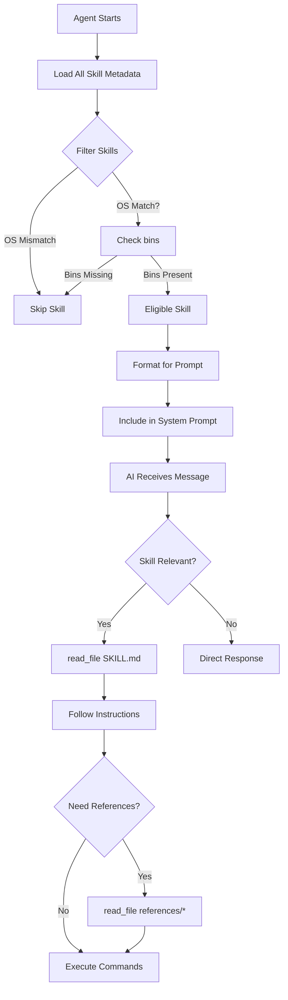
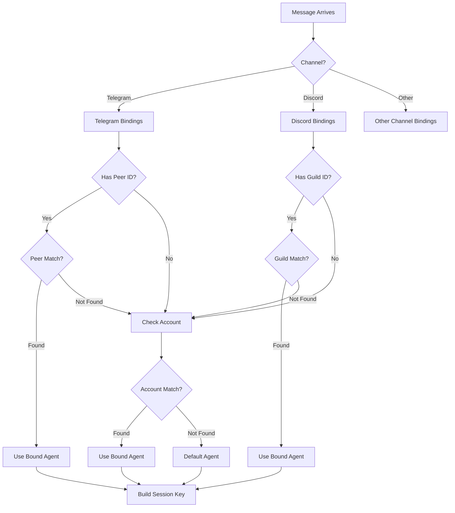
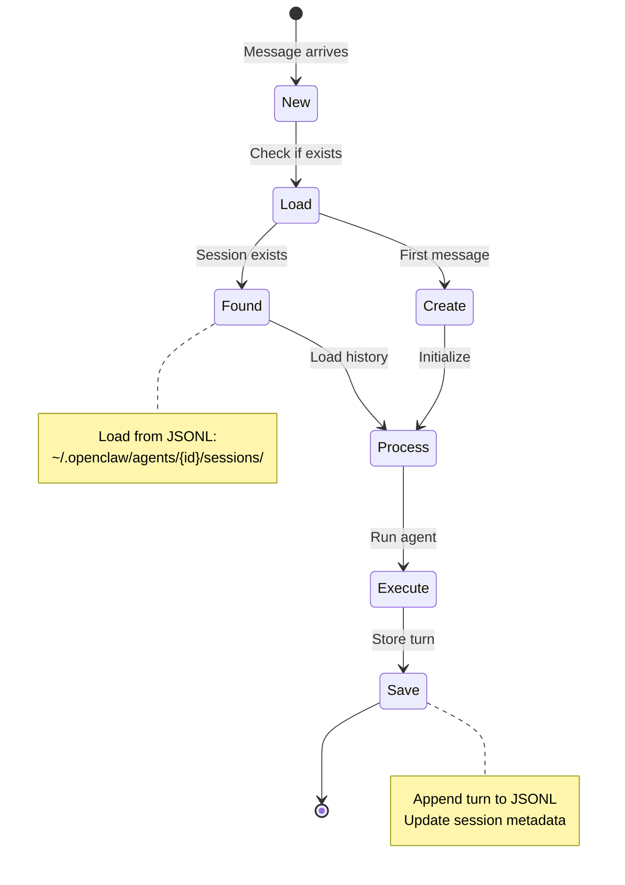
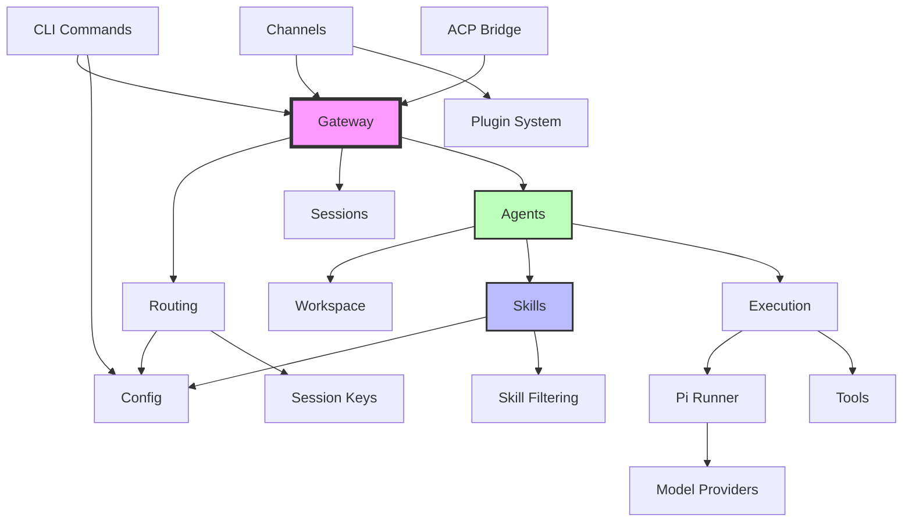

# OpenClaw Architecture Overview

**Last Updated**: February 1, 2026

This document provides a comprehensive overview of OpenClaw's architecture, explaining how components interact, data flows through the system, and the design decisions behind the framework.

## Table of Contents

1. [High-Level Architecture](#high-level-architecture)
2. [Core Components](#core-components)
3. [Message Flow](#message-flow)
4. [Agent System](#agent-system)
5. [Skills System](#skills-system)
6. [Routing & Bindings](#routing--bindings)
7. [Session Management](#session-management)
8. [Design Decisions](#design-decisions)
9. [Module Relationships](#module-relationships)

---

## High-Level Architecture

OpenClaw is a **multi-agent, multi-channel AI assistant framework** with a Gateway-based architecture.



### Key Design Principles

1. **Gateway-Centric**: All messages flow through a central Gateway
2. **Multi-Agent**: Multiple isolated agents with separate workspaces
3. **Multi-Channel**: Support for 10+ messaging platforms
4. **Persistent Sessions**: Conversation state maintained across interactions
5. **Skill-Based**: Extensible capabilities via workspace skills

---

## Core Components

### 1. Gateway (`src/gateway/`)

**Purpose**: Central hub for all agent interactions and session management.

**Responsibilities**:
- WebSocket server (port 18789 by default)
- Route messages to appropriate agents
- Manage persistent sessions
- Handle authentication (tokens/passwords)
- Provide HTTP/WebSocket APIs

**Key Files**:
- `server.ts` - Main Gateway server
- `openai-http.ts` - OpenAI-compatible HTTP API
- `server-methods/agent.ts` - Agent execution RPC method

### 2. Routing System (`src/routing/`)

**Purpose**: Determine which agent handles which message.

**How it works**:


**Binding Priority**:
1. **Peer-specific** (most specific) - Exact chat/user ID
2. **Guild/Team** - Discord server or Teams workspace
3. **Account-specific** - Bot account within channel
4. **Channel-wide** - All chats in a channel type
5. **Default** (fallback) - Default agent from config

**Key Files**:
- `resolve-route.ts` - Main routing logic
- `bindings.ts` - Binding list management
- `session-key.ts` - Session key construction

### 3. Agent System (`src/agents/`)

**Purpose**: Isolated AI agents with separate workspaces and configurations.

**Agent Structure**:
```
Agent
├── ID (e.g., "support", "dev")
├── Workspace Directory
│   ├── skills/
│   ├── memory/
│   └── SYSTEM_PROMPT.md
├── Agent Directory (state)
│   ├── sessions/
│   └── auth-profiles/
├── Configuration
│   ├── Model settings
│   ├── Identity
│   └── Tools config
└── Bindings (routing rules)
```

**Key Files**:
- `agent-scope.ts` - Agent resolution and configuration
- `workspace.ts` - Workspace management
- `pi-embedded-runner/` - Main agent execution
- `system-prompt.ts` - System prompt construction

### 4. Skills System (`src/agents/skills/`)

**Purpose**: Extend agent capabilities with tool-specific knowledge.

**Skill Structure**:
```
skill-name/
├── SKILL.md (required)
│   ├── Frontmatter (name, description, metadata)
│   └── Instructions
├── references/ (optional)
│   └── Advanced documentation
├── scripts/ (optional)
│   └── Executable code
└── assets/ (optional)
    └── Templates/resources
```

**Skill Loading Flow**:


**Key Files**:
- `workspace.ts` - Skill loading and filtering
- `config.ts` - Skill eligibility checks
- `frontmatter.ts` - Metadata parsing
- `types.ts` - Skill type definitions

### 5. Session Management (`src/config/sessions.ts`)

**Purpose**: Persist conversation state across interactions.

**Session Key Format**:
```
agent:{agentId}:{channel}:{accountId}:{peerType}:{peerId}:{context}
```

**Examples**:
- `agent:main:telegram:default:dm:main`
- `agent:support:telegram:default:group:12345:main`
- `agent:dev:discord:default:guild:98765:thread:abc123`

**Session Storage**:
- Location: `~/.openclaw/agents/{agentId}/sessions/`
- Format: JSONL (one entry per turn)
- Contents: Messages, tool calls, model usage, timestamps

**Key Files**:
- `sessions.ts` - Session CRUD operations
- `session-key-utils.ts` - Key parsing and construction

### 6. Message Channels (`src/channels/`, `src/telegram/`, `src/discord/`, etc.)

**Purpose**: Integrate with messaging platforms.

**Channel Plugin Architecture**:


**Built-in Channels**:
- Telegram (`src/telegram/`)
- Discord (`src/discord/`)
- Slack (`src/slack/`)
- Signal (`src/signal/`)
- iMessage (`src/imessage/`)
- WhatsApp Web (`src/web/`)

**Extension Channels** (via plugins):
- Matrix, MS Teams, Zalo, Twitch, BlueBubbles, etc.

**Key Files**:
- `channels/registry.ts` - Channel registration
- `channels/plugins/` - Plugin system
- `{channel}/bot-*.ts` - Channel-specific implementations

---

## Message Flow

### Complete Message Flow: User → Agent → Response



### Detailed Flow Breakdown

#### 1. **Message Reception** (Channel Layer)

**Telegram Example**:
```typescript
// src/telegram/bot-message-context.ts
bot.on("message", async (ctx) => {
  const msgContext = buildTelegramMessageContext(ctx);
  await dispatchTelegramMessage(msgContext, config);
});
```

#### 2. **Routing** (Gateway Layer)

```typescript
// src/routing/resolve-route.ts
export function resolveAgentRoute(input: ResolveAgentRouteInput): ResolvedAgentRoute {
  // 1. Get bindings for channel
  const bindings = listBindings(input.cfg).filter(...);
  
  // 2. Check peer match (most specific)
  if (peer) {
    const peerMatch = bindings.find((b) => matchesPeer(b.match, peer));
    if (peerMatch) return choose(peerMatch.agentId, "binding.peer");
  }
  
  // 3. Check guild/team match
  // 4. Check account match
  // 5. Fall back to default
  return choose(resolveDefaultAgentId(cfg), "default");
}
```

#### 3. **Session Resolution**

```typescript
// Session key construction
const sessionKey = buildAgentSessionKey({
  agentId: "support",
  channel: "telegram",
  accountId: "default",
  peer: { kind: "group", id: "12345" },
  dmScope: "main",
});
// Result: "agent:support:telegram:default:group:12345:main"
```

#### 4. **Agent Execution**

```typescript
// src/auto-reply/reply/get-reply.ts
export async function getReplyFromConfig(ctx, opts, cfg) {
  // 1. Resolve agent ID from session key
  const agentId = resolveSessionAgentId({ sessionKey, config: cfg });
  
  // 2. Load workspace and skills
  const workspaceDir = resolveAgentWorkspaceDir(cfg, agentId);
  const skillsSnapshot = buildWorkspaceSkillSnapshot(workspaceDir, { config: cfg });
  
  // 3. Build system prompt with skills
  const systemPrompt = buildAgentSystemPrompt({
    skillsPrompt: skillsSnapshot.prompt,
    // ... other params
  });
  
  // 4. Run AI model
  return runPreparedReply({ /* ... */ });
}
```

#### 5. **Skill Selection** (AI-Driven)

```typescript
// System prompt includes:
"## Skills (mandatory)
Before replying: scan <available_skills> <description> entries.
- If exactly one skill clearly applies: read its SKILL.md...
- If multiple could apply: choose the most specific one...

<available_skills>
🔐 1password: Set up and use 1Password CLI (op). Use when...reading/injecting/running secrets via op.
📝 apple-notes: Manage Apple Notes via the memo CLI on macOS...
🐙 github: Interact with GitHub using the gh CLI...
</available_skills>"
```

AI model:
1. Reads skill descriptions
2. Determines "1password" is most relevant
3. Uses `read_file` tool to load `skills/1password/SKILL.md`
4. Follows the workflow in the skill

#### 6. **Tool Execution**

```typescript
// AI calls exec tool following skill instructions
exec({
  command: `tmux -S "$SOCKET" send-keys -t "$SESSION" "op signin" Enter`,
  // ... authentication happens
});

exec({
  command: `tmux -S "$SOCKET" send-keys -t "$SESSION" "op item get database" Enter`,
  // ... retrieves password
});
```

#### 7. **Response Delivery**

```typescript
// Gateway sends response back to channel
await channel.sendMessage({
  to: originalMessage.from,
  message: aiResponse,
  replyTo: originalMessage.id,
});
```

---

## Agent System

### Agent Isolation

Each agent is **completely isolated**:



**Why Isolation?**
- **Security**: Different permission levels per agent
- **Organization**: Specialized skills per domain
- **Context**: Separate conversation histories
- **Flexibility**: Different models/configs per agent

### Agent Configuration

```json
{
  "agents": {
    "defaults": {
      "id": "main",
      "model": "anthropic/claude-sonnet-4"
    },
    "list": [
      {
        "id": "support",
        "name": "Support Agent",
        "workspace": "./support-workspace",
        "agentDir": "~/.openclaw/agents/support",
        "model": "anthropic/claude-sonnet-4",
        "identity": {
          "name": "Support Bot",
          "emoji": "🛟"
        }
      },
      {
        "id": "dev",
        "workspace": "./dev-workspace",
        "model": "anthropic/claude-opus-4"
      }
    ]
  }
}
```

---

## Skills System

### Skill Architecture

**3-Tier Loading**:
1. **Metadata** (always loaded) - Name, description, requirements
2. **SKILL.md body** (when selected) - Instructions and workflow
3. **References** (as needed) - Additional documentation



### Skill Scoping Example

**Good: Platform-Specific Skills**
```
skills/
├── apple-notes/          # macOS only, memo CLI
├── bear-notes/           # macOS only, grizzly CLI
└── obsidian/             # Cross-platform, obsidian-cli
```

**Bad: Catch-All Skill**
```
skills/
└── notes/               # ❌ Tries to handle all note apps
```

### Skill Metadata Specialization

```yaml
# apple-notes
metadata:
  openclaw:
    emoji: "📝"
    os: ["darwin"]              # macOS only
    requires:
      bins: ["memo"]            # Requires memo CLI
    install:
      - kind: "brew"
        formula: "antoniorodr/memo/memo"
```

**Effect**: Skill only loads on macOS when `memo` is installed.

---

## Routing & Bindings

### Binding Data Structure

**AgentBinding Type** (`src/config/types.agents.ts`):
```typescript
type AgentBinding = {
  agentId: string;      // Which agent handles matched messages
  match: {
    channel: string;    // Required: "telegram", "discord", etc.
    accountId?: string; // Optional: specific bot account (or "*" for all)
    peer?: {            // Optional: specific chat/user
      kind: "dm" | "group" | "channel";
      id: string;       // Chat/user ID from the platform
    };
    guildId?: string;   // Optional: Discord server ID
    teamId?: string;    // Optional: MS Teams workspace ID
  };
};
```

**Resolved Route Output** (`src/routing/resolve-route.ts`):
```typescript
type ResolvedAgentRoute = {
  agentId: string;         // Selected agent ID
  channel: string;         // Normalized channel name
  accountId: string;       // Bot account (or "default")
  sessionKey: string;      // Full session key for persistence
  mainSessionKey: string;  // Simplified main session key
  matchedBy:              // How the route was determined
    | "binding.peer"      // Matched specific peer ID
    | "binding.guild"     // Matched Discord guild
    | "binding.team"      // Matched Teams workspace
    | "binding.account"   // Matched bot account
    | "binding.channel"   // Matched channel wildcard
    | "default";          // Fell back to default agent
};
```

### Binding Configuration Examples

```json
{
  "bindings": [
    {
      "agentId": "support",
      "match": {
        "channel": "telegram",
        "peer": { "kind": "group", "id": "12345" }
      }
    },
    {
      "agentId": "dev",
      "match": {
        "channel": "discord",
        "guildId": "98765"
      }
    },
    {
      "agentId": "main",
      "match": {
        "channel": "telegram",
        "accountId": "*"
      }
    }
  ]
}
```

### Session Key Structure

Session keys follow hierarchical patterns for different scoping levels:

**Full Session Key Format:**
```
agent:{agentId}:{channel}:{accountId}:{peerType}:{peerId}:{context}
```

**Scoping Variants (`dmScope` configuration):**
- `"main"` → `agent:{agentId}:main` (agent-wide)
- `"per-peer"` → `agent:{agentId}:peer:{peerType}:{peerId}` (cross-channel per-user)
- `"per-channel-peer"` → `agent:{agentId}:{channel}:peer:{peerType}:{peerId}` (channel-specific)
- `"per-account-channel-peer"` → Full key above (account + channel + peer)

**Examples:**
```
agent:main:telegram:default:dm:123456789        # Telegram DM
agent:support:discord:bot1:group:98765:thread1  # Discord thread
agent:main:main                                 # Agent-wide main session
```

**Parsed Session Key** (`ParsedAgentSessionKey`):
```typescript
{
  agentId: string;  // Extracted from key prefix
  rest: string;     // Remaining key components
}
```

**Key Files**:
- `src/routing/session-key.ts` - Session key construction
- `src/sessions/session-key-utils.ts` - Parsing utilities

### Routing Decision Tree



### Why Bindings?

**Without Bindings**:
- All messages go to one agent
- No specialization possible
- Mixed contexts and capabilities

**With Bindings**:
- Support agent for customer groups
- Dev agent for engineering channels
- Different skills per use case
- Isolated conversation contexts

---

## Session Management

### Session Lifecycle



### Session Contents

**Session Entry** (one per turn):
```json
{
  "sessionId": "uuid-1234",
  "updatedAt": 1738368000000,
  "messages": [
    {"role": "user", "content": "Get my password"},
    {"role": "assistant", "content": "Here it is..."}
  ],
  "usage": {
    "inputTokens": 1234,
    "outputTokens": 567,
    "cost": 0.0123
  },
  "model": "anthropic/claude-sonnet-4",
  "skillsSnapshot": {
    "prompt": "...",
    "skills": ["1password", "github"],
    "version": 1
  }
}
```

### Session Scoping

**DM Scope Options** (`config.session.dmScope`):
- `main` (default) - One session per agent/channel (continuity)
- `per-peer` - Separate session per user
- `per-channel-peer` - Separate per channel+user
- `per-account-channel-peer` - Most isolated

**Why Different Scopes?**
- **Shared inbox**: Use `per-peer` for multi-user support
- **Personal bot**: Use `main` for conversation continuity
- **Multi-account**: Use `per-account-channel-peer` for isolation

---

## Design Decisions

### 1. **Why Gateway-Based Architecture?**

**Problem**: Direct channel-to-agent connections are fragile and hard to manage.

**Solution**: Central Gateway acts as message broker.

**Benefits**:
- **Single point of authentication**
- **Unified session management**
- **Remote agent execution** (run Gateway on server, control from anywhere)
- **IDE integration** (ACP bridge to Gateway)
- **Load balancing** possible in future

**Trade-offs**:
- Additional network hop
- Gateway is single point of failure
- Requires port forwarding for remote access

### 2. **Why Skills Instead of MCP?**

**Problem**: Need extensible capabilities without rebuilding core.

**Solution**: Markdown-based skill system with progressive disclosure.

**Benefits**:
- **Human-readable**: Developers can understand and modify
- **Context-efficient**: Load only what's needed (metadata → instructions → references)
- **Platform-aware**: OS/environment filtering via metadata
- **Versionable**: Skills are just files in Git

**Trade-offs**:
- Not industry standard (vs MCP)
- AI-driven selection (not always perfect)
- Skill quality varies

### 3. **Why Multi-Agent Design?**

**Problem**: Single agent tries to do everything, gets confused.

**Solution**: Specialized agents with focused capabilities.

**Benefits**:
- **Domain specialization**: Support agent vs dev agent
- **Security isolation**: Different permissions per agent
- **Skill scoping**: Load only relevant skills
- **Context separation**: Different conversation histories

**Trade-offs**:
- Configuration complexity
- Resource usage (multiple workspaces)
- User confusion if bindings overlap

### 4. **Why Persistent Sessions?**

**Problem**: Stateless interactions lose conversation context.

**Solution**: JSONL-based session storage.

**Benefits**:
- **Conversation continuity**: Remember previous turns
- **Cost tracking**: Per-session usage metrics
- **Debugging**: Full conversation history
- **Resume capability**: Pick up where you left off

**Trade-offs**:
- Disk usage grows over time
- Privacy concerns (stored indefinitely)
- Compaction needed for long conversations

### 5. **Why TypeScript + Node.js?**

**Technical Stack**:
- TypeScript for type safety
- Node.js 22+ for runtime
- Bun supported for development
- ESM modules throughout

**Benefits**:
- **Rich ecosystem**: npm packages for everything
- **Type safety**: Catch errors at compile time
- **Cross-platform**: macOS, Linux, Windows
- **Fast iteration**: Hot reload in development

**Trade-offs**:
- Runtime performance (vs Go/Rust)
- Memory usage
- Cold start times

---

## Module Relationships

### Directory Structure

```
openclaw/
├── src/
│   ├── agents/           # Agent execution & management
│   │   ├── skills/       # Skill loading & filtering
│   │   └── pi-embedded-runner/  # AI model execution
│   ├── auto-reply/       # Message processing & reply logic
│   │   └── reply/        # Reply pipeline stages
│   ├── channels/         # Channel plugins & registry
│   ├── routing/          # Agent routing & session keys
│   ├── gateway/          # Gateway server & RPC
│   ├── config/           # Configuration & validation
│   ├── cli/              # CLI commands
│   └── acp/              # ACP bridge for IDEs
├── skills/               # Built-in skills (100+)
├── extensions/           # Extension plugins (channels, etc.)
├── apps/                 # Platform apps
│   ├── macos/            # macOS menubar app
│   ├── ios/              # iOS app
│   └── android/          # Android app
└── docs/                 # Documentation
```

### Dependency Graph



### Core Module Interactions

**1. Message Reception → Agent Execution**
```
Channel Plugin → Gateway → Router → Session Manager → Agent → AI Model → Tools → Response
```

**2. Skill Loading**
```
Agent Start → Load Workspace Skills → Filter by Metadata → Format for Prompt → Include in System → AI Selects → Read SKILL.md
```

**3. Configuration Flow**
```
CLI Config Command → Validation → Write JSON → Gateway Reload → Apply to Agents
```

**4. Session Persistence**
```
Message Turn → Build Session Entry → Append to JSONL → Update Index → Prune if Needed
```

---

## Summary

**OpenClaw is**:
- A **Gateway-based** multi-agent framework
- With **multi-channel** support (Telegram, Discord, Slack, etc.)
- Using **isolated agents** with separate workspaces
- Extended by **Markdown skills** (100+ built-in)
- Routing via **bindings** (peer/guild/channel/default)
- Managing **persistent sessions** (JSONL storage)
- Executing via **Pi Coding Agent** or CLI providers
- Integrated with **IDEs** via ACP bridge

**Key Strengths**:
1. **Flexibility**: Any channel → Any agent → Any skill
2. **Isolation**: Agents don't interfere with each other
3. **Extensibility**: Skills are easy to add
4. **Persistence**: Conversations survive restarts
5. **Multi-platform**: Works on macOS, Linux, Windows

**Learning Path**:
1. Start with Gateway (`src/gateway/server.ts`)
2. Understand routing (`src/routing/resolve-route.ts`)
3. Explore agent execution (`src/agents/pi-embedded-runner/run.ts`)
4. Study skill system (`src/agents/skills/workspace.ts`)
5. Examine a channel integration (`src/telegram/`)

**Next Steps**:
- Read specific component docs in `docs/`
- Explore skills in `skills/`
- Try creating a custom agent
- Build a new skill
- Contribute to the project

---

## Additional Resources

- **CLI Reference**: [docs/cli/](../cli/)
- **Configuration Guide**: [docs/reference/](../reference/)
- **Testing Guide**: [docs/testing.md](../testing.md)
- **Release Process**: [docs/reference/RELEASING.md](../reference/RELEASING.md)
- **Agent Guidelines**: [AGENTS.md](../../AGENTS.md)

---

**Questions or Contributions?**  
See [CONTRIBUTING.md](../../CONTRIBUTING.md) for how to get involved.
