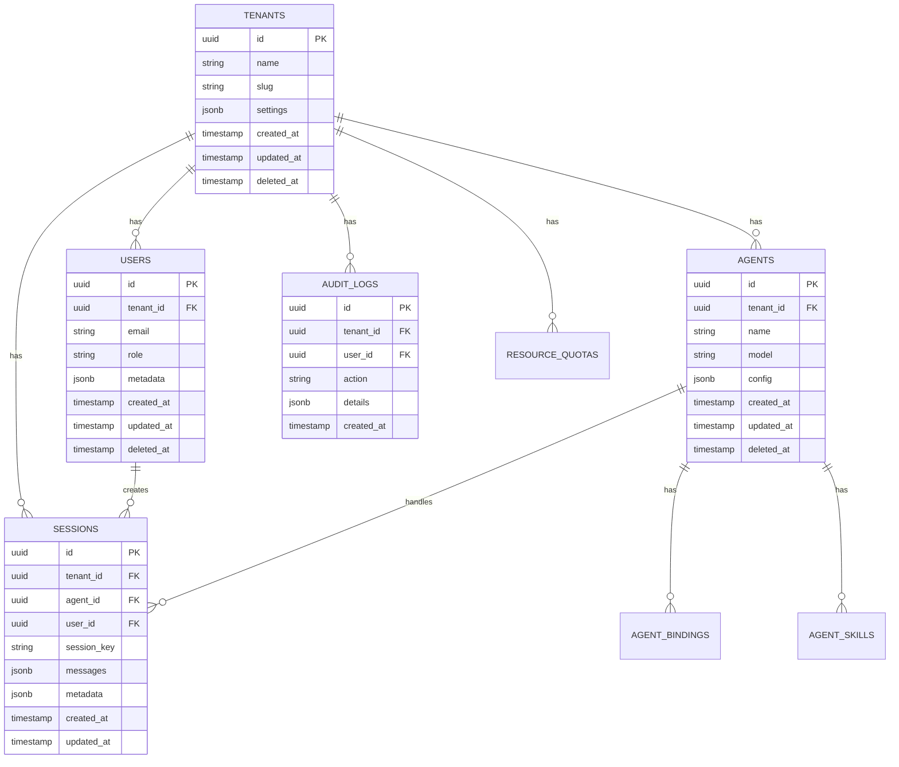

# PostgreSQL Database Schema Design

**Version**: 1.0.0  
**Date**: 2026-02-02  
**Status**: Design  
**Related**: [RLS Policies](rls-policies), [RBAC Matrix](rbac-matrix)

---

## Overview

This document defines the PostgreSQL database schema for OpenClaw's multi-tenant SaaS deployment. The schema supports complete tenant isolation, RBAC, audit logging, and resource quotas while maintaining backward compatibility with the existing JSONL-based single-user mode.

**Design Principles**:
1. **Tenant Isolation**: Every table includes `tenant_id` with Row-Level Security (RLS)
2. **Audit Trail**: All mutations logged with WHO/WHAT/WHEN
3. **Soft Deletes**: Use `deleted_at` for data retention compliance
4. **Timestamps**: All tables have `created_at` and `updated_at`
5. **Foreign Key Cascades**: Enforce referential integrity

---

## Entity Relationship Diagram



---

## Table Definitions

### 1. `tenants`

**Purpose**: Top-level isolation boundary for multi-tenant SaaS

```sql
CREATE TABLE tenants (
    id UUID PRIMARY KEY DEFAULT gen_random_uuid(),
    name VARCHAR(255) NOT NULL,
    slug VARCHAR(100) NOT NULL UNIQUE,
    settings JSONB DEFAULT '{}',
    
    -- Metadata
    created_at TIMESTAMP WITH TIME ZONE DEFAULT NOW(),
    updated_at TIMESTAMP WITH TIME ZONE DEFAULT NOW(),
    deleted_at TIMESTAMP WITH TIME ZONE,
    
    -- Constraints
    CONSTRAINT tenants_slug_format CHECK (slug ~ '^[a-z0-9-]+$')
);

CREATE INDEX idx_tenants_slug ON tenants(slug) WHERE deleted_at IS NULL;
CREATE INDEX idx_tenants_deleted ON tenants(deleted_at);
```

**Settings JSONB Schema**:
```typescript
{
  plan: 'free' | 'pro' | 'enterprise',
  features: {
    multiAgent: boolean,
    sso: boolean,
    customSkills: boolean
  },
  limits: {
    maxUsers: number,
    maxAgents: number,
    maxSessions: number
  }
}
```

---

### 2. `users`

**Purpose**: User accounts with RBAC roles

```sql
CREATE TABLE users (
    id UUID PRIMARY KEY DEFAULT gen_random_uuid(),
    tenant_id UUID NOT NULL REFERENCES tenants(id) ON DELETE CASCADE,
    
    -- Identity
    email VARCHAR(255) NOT NULL,
    password_hash VARCHAR(255), -- NULL for SSO-only users
    role VARCHAR(50) NOT NULL DEFAULT 'viewer',
    
    -- Profile
    full_name VARCHAR(255),
    metadata JSONB DEFAULT '{}',
    
    -- Timestamps
    created_at TIMESTAMP WITH TIME ZONE DEFAULT NOW(),
    updated_at TIMESTAMP WITH TIME ZONE DEFAULT NOW(),
    deleted_at TIMESTAMP WITH TIME ZONE,
    last_login_at TIMESTAMP WITH TIME ZONE,
    
    -- Constraints
    CONSTRAINT users_email_tenant_unique UNIQUE (tenant_id, email, deleted_at),
    CONSTRAINT users_role_valid CHECK (role IN ('owner', 'admin', 'developer', 'operator', 'viewer'))
);

CREATE INDEX idx_users_tenant ON users(tenant_id) WHERE deleted_at IS NULL;
CREATE INDEX idx_users_email ON users(email) WHERE deleted_at IS NULL;
CREATE INDEX idx_users_role ON users(tenant_id, role);
```

**Metadata JSONB Schema**:
```typescript
{
  preferences: {
    theme: 'light' | 'dark',
    notifications: boolean
  },
  sso: {
    provider: 'okta' | 'azure' | 'google',
    externalId: string
  }
}
```

---

### 3. `agents`

**Purpose**: AI agent configurations per tenant

```sql
CREATE TABLE agents (
    id UUID PRIMARY KEY DEFAULT gen_random_uuid(),
    tenant_id UUID NOT NULL REFERENCES tenants(id) ON DELETE CASCADE,
    
    -- Agent Identity
    name VARCHAR(255) NOT NULL,
    description TEXT,
    
    -- Configuration
    model VARCHAR(100) NOT NULL DEFAULT 'claude-3-5-sonnet-20241022',
    system_prompt TEXT,
    config JSONB DEFAULT '{}',
    
    -- Workspace
    workspace_path VARCHAR(500),
    
    -- Timestamps
    created_at TIMESTAMP WITH TIME ZONE DEFAULT NOW(),
    updated_at TIMESTAMP WITH TIME ZONE DEFAULT NOW(),
    deleted_at TIMESTAMP WITH TIME ZONE,
    
    -- Constraints
    CONSTRAINT agents_name_tenant_unique UNIQUE (tenant_id, name, deleted_at)
);

CREATE INDEX idx_agents_tenant ON agents(tenant_id) WHERE deleted_at IS NULL;
CREATE INDEX idx_agents_name ON agents(tenant_id, name);
```

**Config JSONB Schema**:
```typescript
{
  temperature: number,
  maxTokens: number,
  dmPolicy: 'open' | 'pairing' | 'allowlist',
  dmScope: 'main' | 'per-peer' | 'per-channel-peer',
  skills: {
    enabled: string[],
    disabled: string[]
  }
}
```

---

### 4. `agent_bindings`

**Purpose**: Route messages from channels to agents

```sql
CREATE TABLE agent_bindings (
    id UUID PRIMARY KEY DEFAULT gen_random_uuid(),
    tenant_id UUID NOT NULL REFERENCES tenants(id) ON DELETE CASCADE,
    agent_id UUID NOT NULL REFERENCES agents(id) ON DELETE CASCADE,
    
    -- Binding Rules
    channel VARCHAR(50) NOT NULL,
    account_id VARCHAR(255),
    peer_type VARCHAR(50),
    peer_id VARCHAR(255),
    guild_id VARCHAR(255),
    
    -- Priority (lower = higher priority)
    priority INTEGER DEFAULT 100,
    
    -- Timestamps
    created_at TIMESTAMP WITH TIME ZONE DEFAULT NOW(),
    updated_at TIMESTAMP WITH TIME ZONE DEFAULT NOW(),
    
    -- Constraints
    CONSTRAINT bindings_channel_valid CHECK (channel IN ('telegram', 'discord', 'slack', 'signal', 'whatsapp', 'imessage', 'web'))
);

CREATE INDEX idx_bindings_tenant ON agent_bindings(tenant_id);
CREATE INDEX idx_bindings_agent ON agent_bindings(agent_id);
CREATE INDEX idx_bindings_lookup ON agent_bindings(tenant_id, channel, account_id, peer_id);
```

---

### 5. `sessions`

**Purpose**: Persistent conversation history

```sql
CREATE TABLE sessions (
    id UUID PRIMARY KEY DEFAULT gen_random_uuid(),
    tenant_id UUID NOT NULL REFERENCES tenants(id) ON DELETE CASCADE,
    agent_id UUID NOT NULL REFERENCES agents(id) ON DELETE CASCADE,
    user_id UUID REFERENCES users(id) ON DELETE SET NULL,
    
    -- Session Identity
    session_key VARCHAR(500) NOT NULL,
    
    -- Conversation Data
    messages JSONB DEFAULT '[]',
    metadata JSONB DEFAULT '{}',
    
    -- Statistics
    message_count INTEGER DEFAULT 0,
    token_count INTEGER DEFAULT 0,
    
    -- Timestamps
    created_at TIMESTAMP WITH TIME ZONE DEFAULT NOW(),
    updated_at TIMESTAMP WITH TIME ZONE DEFAULT NOW(),
    last_message_at TIMESTAMP WITH TIME ZONE,
    
    -- Constraints
    CONSTRAINT sessions_key_unique UNIQUE (tenant_id, session_key)
);

CREATE INDEX idx_sessions_tenant ON sessions(tenant_id);
CREATE INDEX idx_sessions_agent ON sessions(agent_id);
CREATE INDEX idx_sessions_user ON sessions(user_id);
CREATE INDEX idx_sessions_key ON sessions(session_key);
CREATE INDEX idx_sessions_updated ON sessions(updated_at DESC);
```

**Messages JSONB Schema**:
```typescript
[
  {
    role: 'user' | 'assistant' | 'system',
    content: string,
    timestamp: string,
    metadata: {
      channel: string,
      peerId: string,
      tokenCount: number
    }
  }
]
```

---

### 6. `audit_logs`

**Purpose**: Immutable audit trail for compliance

```sql
CREATE TABLE audit_logs (
    id UUID PRIMARY KEY DEFAULT gen_random_uuid(),
    tenant_id UUID NOT NULL REFERENCES tenants(id) ON DELETE CASCADE,
    user_id UUID REFERENCES users(id) ON DELETE SET NULL,
    
    -- Action Details
    action VARCHAR(100) NOT NULL,
    resource_type VARCHAR(100),
    resource_id UUID,
    
    -- Context
    details JSONB DEFAULT '{}',
    ip_address INET,
    user_agent TEXT,
    
    -- Timestamp (immutable)
    created_at TIMESTAMP WITH TIME ZONE DEFAULT NOW()
);

CREATE INDEX idx_audit_tenant ON audit_logs(tenant_id, created_at DESC);
CREATE INDEX idx_audit_user ON audit_logs(user_id, created_at DESC);
CREATE INDEX idx_audit_action ON audit_logs(action, created_at DESC);
CREATE INDEX idx_audit_resource ON audit_logs(resource_type, resource_id);
```

**Action Types**:
- `user.login`, `user.logout`, `user.created`, `user.deleted`
- `agent.created`, `agent.updated`, `agent.deleted`
- `session.created`, `session.deleted`
- `skill.installed`, `skill.removed`
- `config.updated`

---

### 7. `resource_quotas`

**Purpose**: Per-tenant resource limits and usage tracking

```sql
CREATE TABLE resource_quotas (
    id UUID PRIMARY KEY DEFAULT gen_random_uuid(),
    tenant_id UUID NOT NULL REFERENCES tenants(id) ON DELETE CASCADE,
    
    -- Quotas
    max_users INTEGER DEFAULT 5,
    max_agents INTEGER DEFAULT 3,
    max_sessions INTEGER DEFAULT 100,
    max_tokens_per_month BIGINT DEFAULT 1000000,
    max_cpu_cores INTEGER DEFAULT 2,
    max_memory_mb INTEGER DEFAULT 2048,
    max_disk_mb INTEGER DEFAULT 10240,
    
    -- Current Usage
    current_users INTEGER DEFAULT 0,
    current_agents INTEGER DEFAULT 0,
    current_sessions INTEGER DEFAULT 0,
    current_tokens_this_month BIGINT DEFAULT 0,
    
    -- Timestamps
    created_at TIMESTAMP WITH TIME ZONE DEFAULT NOW(),
    updated_at TIMESTAMP WITH TIME ZONE DEFAULT NOW(),
    quota_reset_at TIMESTAMP WITH TIME ZONE DEFAULT DATE_TRUNC('month', NOW() + INTERVAL '1 month'),
    
    -- Constraints
    CONSTRAINT quotas_tenant_unique UNIQUE (tenant_id)
);

CREATE INDEX idx_quotas_tenant ON resource_quotas(tenant_id);
```

---

### 8. `agent_skills`

**Purpose**: Track installed skills per agent with versioning

```sql
CREATE TABLE agent_skills (
    id UUID PRIMARY KEY DEFAULT gen_random_uuid(),
    tenant_id UUID NOT NULL REFERENCES tenants(id) ON DELETE CASCADE,
    agent_id UUID NOT NULL REFERENCES agents(id) ON DELETE CASCADE,
    
    -- Skill Identity
    skill_name VARCHAR(255) NOT NULL,
    skill_version VARCHAR(50) NOT NULL,
    
    -- Configuration
    enabled BOOLEAN DEFAULT TRUE,
    config JSONB DEFAULT '{}',
    
    -- Timestamps
    created_at TIMESTAMP WITH TIME ZONE DEFAULT NOW(),
    updated_at TIMESTAMP WITH TIME ZONE DEFAULT NOW(),
    
    -- Constraints
    CONSTRAINT skills_agent_name_unique UNIQUE (agent_id, skill_name)
);

CREATE INDEX idx_skills_agent ON agent_skills(agent_id) WHERE enabled = TRUE;
CREATE INDEX idx_skills_tenant ON agent_skills(tenant_id);
```

---

## Migration Strategy

### Phase 1: Schema Creation
1. Create tables in dependency order (tenants → users → agents → sessions)
2. Enable RLS on all tables (see [rls-policies.md](rls-policies))
3. Create indexes for performance

### Phase 2: Data Migration (JSONL → PostgreSQL)
```typescript
// Migrate existing single-user data
async function migrateFromJsonl() {
  // 1. Create default tenant
  const tenant = await createTenant({ name: 'Default', slug: 'default' });
  
  // 2. Create default user (owner)
  const user = await createUser({ 
    tenantId: tenant.id, 
    email: 'admin@localhost', 
    role: 'owner' 
  });
  
  // 3. Migrate agents from ~/.openclaw/agents/
  for (const agentDir of listAgentDirs()) {
    const agent = await createAgent({ 
      tenantId: tenant.id, 
      name: agentDir.name 
    });
    
    // 4. Migrate sessions from JSONL files
    for (const sessionFile of listSessionFiles(agentDir)) {
      await migrateSession({ 
        tenantId: tenant.id, 
        agentId: agent.id, 
        jsonlPath: sessionFile 
      });
    }
  }
}
```

### Phase 3: Dual-Write Mode
- Write to both JSONL and PostgreSQL during transition
- Validate data consistency
- Switch read traffic to PostgreSQL incrementally

### Phase 4: PostgreSQL-Only
- Disable JSONL writes
- Archive JSONL files for backup
- Full PostgreSQL mode

---

## Performance Considerations

### Indexing Strategy
- **Tenant isolation**: All queries filtered by `tenant_id` (indexed)
- **Session lookups**: `session_key` unique index
- **Audit queries**: Composite index on `(tenant_id, created_at DESC)`
- **Soft deletes**: Partial indexes with `WHERE deleted_at IS NULL`

### Partitioning (Future)
```sql
-- Partition sessions by month for large tenants
CREATE TABLE sessions_2026_02 PARTITION OF sessions
    FOR VALUES FROM ('2026-02-01') TO ('2026-03-01');
```

### Connection Pooling
- Use `pg` with connection pool (max 20 connections per instance)
- Implement tenant context via `SET LOCAL` for RLS

---

## Backup & Recovery

### Backup Strategy
- **Hourly incremental**: WAL archiving
- **Daily full**: `pg_dump` per tenant
- **Retention**: 2 years (per FR-016)

### RTO/RPO Targets (FR-019)
- **RTO**: 4 hours
- **RPO**: 15 minutes

---

## Next Steps

1. ✅ Review this schema design
2. → Implement RLS policies ([rls-policies.md](rls-policies))
3. → Define RBAC permissions ([rbac-matrix.md](rbac-matrix))
4. → Create migration framework (T009)
5. → Implement connection pool (T010)
