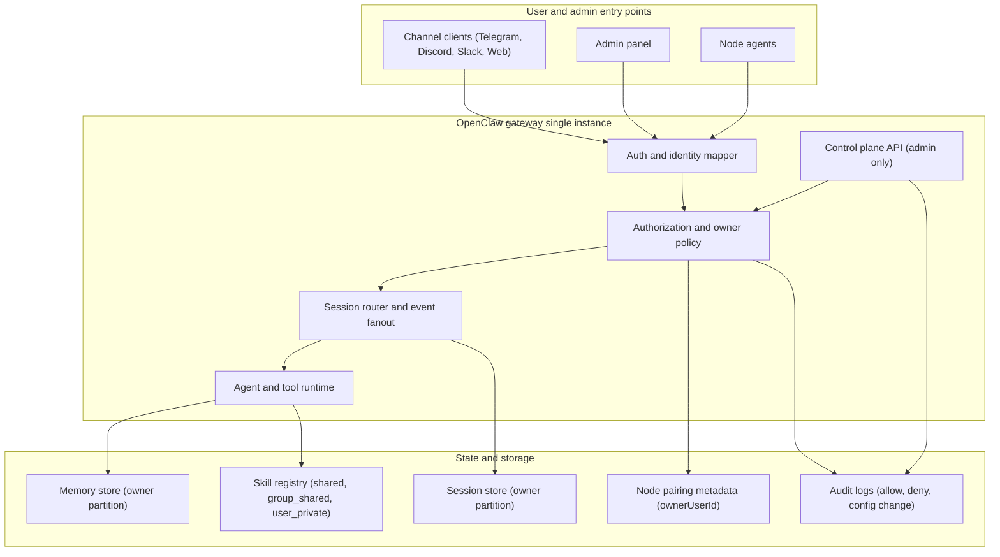
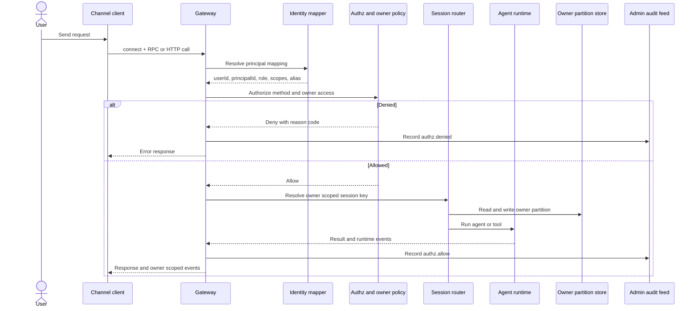

# Multi user architecture

This document defines the target architecture for one OpenClaw gateway instance serving multiple users with strict isolation.

Related docs:

- [Multi user roadmap](/gateway/multi-tenant)
- [Multi user deployment checklist](/gateway/multi-user-deployment)

## Core principles

1. One canonical owner identity per request (`userId`, `principalId`, `role`).
2. Session and memory data are owner partitioned by default.
3. Runtime events fan out only to owner authorized clients unless admin visibility is explicitly allowed.
4. Control plane mutation is admin only.
5. Audit trails record both allow and deny decisions.

## Technical diagram component view

## Technical diagram request flow

## Ownership matrix

| Resource                 | Ownership field                              | Default visibility  | Admin override             |
| ------------------------ | -------------------------------------------- | ------------------- | -------------------------- |
| Sessions                 | `ownerUserId`                                | Owner only          | Yes, explicit owner filter |
| Memory entries           | `ownerUserId` partition                      | Owner only          | Yes                        |
| Nodes                    | Pairing metadata `ownerUserId`               | Owner only          | Yes                        |
| Agents                   | `ownerUserId`                                | Owner only          | Yes                        |
| Skills                   | `shared` or `group_shared` or `user_private` | Based on visibility | Yes                        |
| Config and control plane | Admin principal role                         | Hidden from users   | Not required               |
